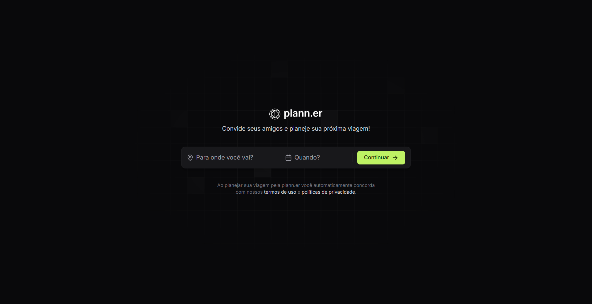

<!-- <h3 align="center">
  plann.er
</h3> -->

Um app para criar e organizar viagens em grupo.

<!-- 

  <a href="#-tecnologias">Tecnologias</a>&nbsp;&nbsp;&nbsp;|&nbsp;&nbsp;&nbsp;
  <a href="#-projeto">Projeto</a>&nbsp;&nbsp;&nbsp;|&nbsp;&nbsp;&nbsp;
  <a href="#-layout">Layout</a>&nbsp;&nbsp;&nbsp;|&nbsp;&nbsp;&nbsp;
  <a href="#memo-licença">Licença</a>

 -->

---

### Tecnologias

Esse projeto foi desenvolvido com as seguintes tecnologias:

- HTML, TailwindCSS e TypeScript
- Git e Github
- Figma
- ReactJS

### Projeto

Esse app foi idealizado pela [Rocketseat](https://www.youtube.com/@rocketseat), e foi criado seguindo as aulas da trilha de ReactJS do [NLW Journey](https://www.youtube.com/watch?v=PetriYiuZRU).

- [Link para o app](https://ijuulia.github.io/planner/)
- [Projeto no Figma](https://www.figma.com/community/file/1392276515495389646/nlw-journey-planejador-de-viagem)
